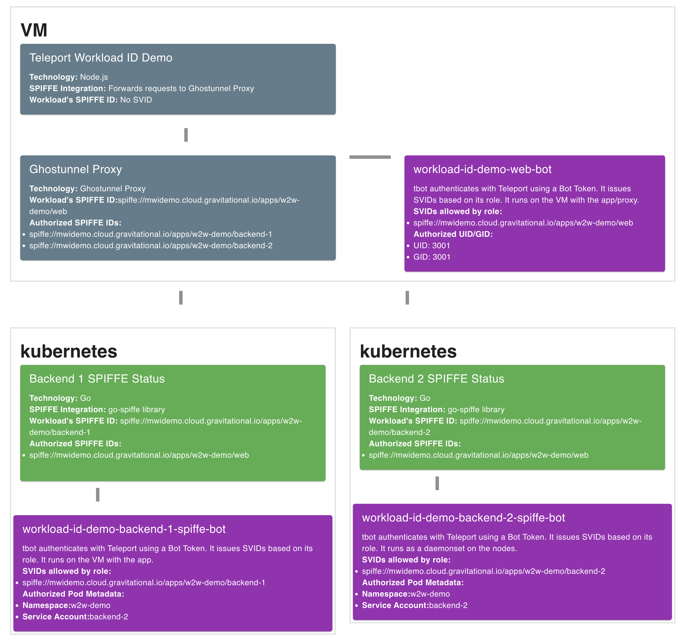

# Workload ID Demo
Demo infrastructure and applications of Teleport Workload ID

## Overview

The demo consists of four core components:
* A Node app that has no inherent SPIFFE support, which calls to
* A [Ghostunnel](https://github.com/ghostunnel/ghostunnel) proxy instance running in client mode, which calls to
* Two backends, written in Go, using the `go-spiffe` SDK
* `tbot` instances that provide SVIDs for Ghostunnel and the backend app

The Node app and Ghostunnel are deployed to a VM together,
Backend 1 is deployed to its own VM, and Backend 2 is deployed to Kubernetes.

By using mutually verifying SPIFFE IDs, the two apps communicate via mTLS wit
guaranteed mutual identity.

### Accessing the Demo

The [live demo page](https://workload-id-demo.teleport-ent-15.asteroid.earth/) is protected via Teleport App Access. You need access to the
demo Teleport cluster running at https://teleport-ent-15.asteroid.earth.
If you are a Teleport employee, please reach out to Ben or Dave for access.

## Components

### Backend 1

The [backend app](./backend/main.go) is fairly simple. It is a go HTTP(S) server
that uses the `spiffe-go` library to communicate with the workload API. It takes
a socket to reach the API on, and a SPIFFE ID that it should authenticate before
accepting traffic. It returns its name, what kind of infrastructure it is running on,
its own SPIFFE ID, and what IDs it verifies.

The goal with this code is that it can be deployed more times in other infrastructure,
easily expanding the demo. See [Future Improvements](#future-improvements) below.

### Backend 2

This is the same app as above, but it's running in Kubernetes rather than a VM, using tbot as a DaemonSet
that uses ServiceAccount and Namespace for workload attestation.

### Web

The [web app](./web/index.js) serves up a visualization of the system, shown by the
screenshot at the beginning of the README. If it cannot communicate with a given backend,
it turns the card for that backend red and displays the error, otherwise the card is green
and displays the metadata returned from the backend. It requires Ghostunnel to communicate
with the backend.

### Terraform

There are many things stood up here, so this is a catalogue to more easily find things
* Found in [teleport.tf](./terraform/teleport.tf)
  * Roles for the bots, that allow them to create SVIDs for specific SPIFFE IDs. Found in [teleport.tf](./terraform/teleport.tf)
  * Tokens for the bots, alloing them to join from their instances. Found in [teleport.tf](./terraform/teleport.tf)
  * A token for the nodes themselves to join with, so we can access the nodes using SSH Access
from our Teleport cluster. Found in [teleport.tf](./terraform/teleport.tf)
* A bot each for the frontend and backend to use, using [bots.yaml](./terraform/bots.yaml), since they currently don't work through our Terraform provider. This is run
using `$ tctl create -f bots.yaml`
* Found in [vms.tf](./terraform/vms.tf)
  * AWS IAM role for our nodes, which matches that allowed in the node token in Teleport
  * AWS Security Group that allows incoming traffic on 443 for the TLS traffic to the apps, and all egress so that the Teleport agents can communicate with the cluster
  * Two VMs, one each for the frontend and the backend
  * Two Cloud Init configs used to start up the VMs. They use several scripts to auto-initialize everything:
    * [create_web_teleport_config.sh](./terraform/create_web_teleport_config.sh.tftpl) and [create_backend_teleport_config.sh](./terraform/create_backend_teleport_config.sh.tftpl) are on each VM to set up Teleport. The web config has App Access configured in addition to the SSH service on the backend
    * [install_teleport.sh](./terraform/install_teleport.sh) is on both VMs, installing it and setting up a systemd service
    * [create_tbot_config.sh](./terraform/create_tbot_config.sh.tftpl) is on both VMs, setting up `tbot` as a systemd service to join the Teleport cluster and start issuing SVIDs
    * [install_ghostunnel.sh](./terraform/install_ghostunnel.sh.tftpl) and [start_web.sh](./terraform/start_web.sh) are on the web VM to start the apps as systemd services
    * [start_backend.sh](./terraform/start_backend.sh.tftpl) is on the backend VM to start the app as a systemd service
* Found in [k8s.tf](./terraform/k8s.tf) and [k8s-sidecar.tf](./terraform/k8s-sidecar.tf)
  * Resources for running tbot for Workload ID either as a DaemonSet or as a sidecar. The DaemonSet is preferable but the sidecar is another architectural option.
  * **NOTE: You need a pre-existing K8s cluster to feed
  into Terraform as a provider. This TF does not stand up
  a cluster.** That is a future improvement I would like to make.

## Development

There is a [testing](./testing) directory with several helper scripts. To
develop locally, you must have the ability to create bots within the
Teleport cluster. Have multiple terminal windows open, and, from the
testing directory, run the following commands across them to do local development:
1. `$ sudo ./create-backend-bot.sh`
1. `$ sudo ./create-web-bot.sh`
1. `$ sudo ./start-ghostunnel.sh`
1. `$ sudo ./start-backend.sh`
1. In the web directory, run `$ npm run dev`

## Future Improvements

The main improvement I want to make is adding more backends, starting
with Kubernetes. It would also be good to have a mix backends in success
and failure states to show those without needing to change things mid-demo.
